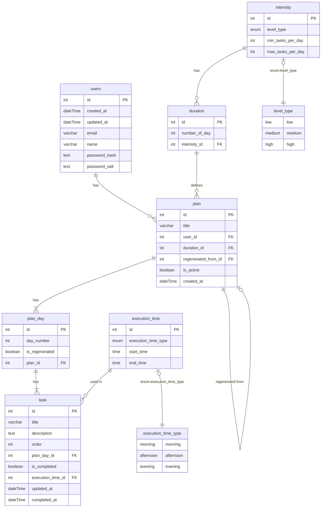

# Plan overview page

## 1. Quiz and Plan Generation
- Based on quiz results, a personalized plan is generated.
- The plan has:
  - A defined duration: **5, 14, or 21 days**.
  - Each duration should have its **intensity** and **frequency** of the task.
- Each user can have **multiple plans**.
- Plans are **personalised and cannot be shared**.

---

## 2. Plan Management
A user can:
- View all generated plans.
- Regenerate a plan (partially or completely).
- Regenerate a specific day or task.
- Edit individual task text.

Additional details:
- A plan stores its origin:
  - Reference to the plan it was regenerated from.
- Plans have an **active status** (e.g., only one active plan at a time).
- Plan **creation timestamp** is recorded.
- Plans have a list of **days (`plan_day`)**, and each day has:
  - An order number.
  - A list of tasks.

---

## 3. Task Structure & Tracking
- Each day (`plan_day`) has **1–5 tasks**, but the data model should allow any number of tasks per day.
- Tasks contain:
  - Plain text **title** and **description**.
  - Optional **tip**.
  - **Execution time** (morning, afternoon, evening).
  - **Order** within the day.
  - **Timestamps** for updates and completion.
- Tasks can be marked as **complete/incomplete**.
- Tasks do not have deadlines or unlock timers.

---

## 4. Progress & History
The system tracks:
- **History of checklists** should be saved.
- **History of plans**, so a user can return to and update previous plans.

# Conceptual Data Model



# Physical Data Model

```
CREATE TYPE level_type AS ENUM ('low', 'medium', 'high');
CREATE TYPE execution_time_type AS ENUM ('morning', 'afternoon', 'evening');

CREATE TABLE intensity (
  id SERIAL PRIMARY KEY,
  level_type level NOT NULL,
  min_tasks_per_day INT CHECK (min_tasks_per_day > 0) NOT NULL,
  max_tasks_per_day INT CHECK (max_tasks_per_day >= min_tasks_per_day) NOT NULL,
  created_at TIMESTAMPTZ DEFAULT CURRENT_TIMESTAMP NOT NULL
);

CREATE TABLE duration (
  id SERIAL PRIMARY KEY,
  number_of_days INT CHECK (number_of_days > 0) NOT NULL,
  intensity_id INT NOT NULL REFERENCES intensity(id) ON DELETE RESTRICT,
  created_at TIMESTAMPTZ DEFAULT CURRENT_TIMESTAMP NOT NULL
);

CREATE TABLE plan (
  id SERIAL PRIMARY KEY,
  title VARCHAR(100) NOT NULL,
  user_id INT NOT NULL REFERENCES users(id) ON DELETE CASCADE,
  duration_id INT NOT NULL REFERENCES duration(id) ON DELETE RESTRICT,
  regenerated_from_id INT REFERENCES plan(id) ON DELETE SET NULL,
  is_active BOOLEAN DEFAULT TRUE NOT NULL,
  created_at TIMESTAMPTZ DEFAULT CURRENT_TIMESTAMP NOT NULL
);

CREATE TABLE plan_day (
  id SERIAL PRIMARY KEY,
  day_number INT CHECK (day_number > 0) NOT NULL,
  is_regenerated BOOLEAN DEFAULT FALSE NOT NULL,
  plan_id INT NOT NULL REFERENCES plan(id) ON DELETE CASCADE
);

CREATE TABLE execution_time (
  id SERIAL PRIMARY KEY,
  execution_time_type execution_time_type NOT NULL,
  start_time TIME NOT NULL,
  end_time TIME NOT NULL,
  CHECK (start_time < end_time)
);

CREATE TABLE task (
  id SERIAL PRIMARY KEY,
  title VARCHAR(200) NOT NULL,
  description TEXT,
  order INT CHECK (order >= 0) NOT NULL,
  plan_day_id INT NOT NULL REFERENCES plan_day(id) ON DELETE CASCADE,
  is_completed BOOLEAN DEFAULT FALSE NOT NULL,
  execution_time_id INT REFERENCES execution_time(id) ON DELETE SET NULL,
  updated_at TIMESTAMPTZ DEFAULT CURRENT_TIMESTAMP NOT NULL,
  completed_at NULL
);
```

#  1. Table: intensity
Description: stores the intensity levels associated with tasks, defining how many tasks should be done daily based on difficulty.

| Column              | Type                | Description                                                       | Constraints                                     | Default            |
| ------------------- | ------------------- | ----------------------------------------------------------------- | ----------------------------------------------- | ------------------ |
| `id`                | SERIAL PRIMARY KEY  | Unique identifier for the intensity record                        | PK                                              | Auto-increment     |
| `level_type`        | ENUM (`level_type`) | Intensity level category                                          | Not null, values: `'low'`, `'medium'`, `'high'` | None               |
| `min_tasks_per_day` | INT                 | Minimum number of tasks assigned per day for this intensity level | Not null, > 0                                   | None               |
| `max_tasks_per_day` | INT                 | Maximum number of tasks assigned per day for this intensity level | Not null, >= `min_tasks_per_day`                | None               |
| `created_at`        | TIMESTAMPTZ         | Timestamp when the intensity record was created                   | Not null                                        | CURRENT\_TIMESTAMP |

# Constraints Explanation:
- min_tasks_per_day must be greater than 0.
- max_tasks_per_day must be equal or greater than min_tasks_per_day.

#  2. Table: duration
Description: defines plan durations in days linked to a specific intensity level.

| Column           | Type               | Description                                           | Constraints                                        | Default            |
| ---------------- | ------------------ | ----------------------------------------------------- | -------------------------------------------------- | ------------------ |
| `id`             | SERIAL PRIMARY KEY | Unique identifier for the duration                    | PK                                                 | Auto-increment     |
| `number_of_days` | INT                | Length of the plan in days                            | Not null, > 0                                      | None               |
| `intensity_id`   | INT                | Reference to intensity level this duration belongs to | Not null, FK → `intensity(id)`, ON DELETE RESTRICT | None               |
| `created_at`     | TIMESTAMPTZ        | Timestamp when the duration record was created        | Not null                                           | CURRENT\_TIMESTAMP |

# Constraints Explanation:
- cannot delete an intensity if referenced by any duration (ON DELETE RESTRICT).
- number_of_days must be positive.

# 3. Table: plan
Description: represents a plan created by a user, with a certain duration and intensity.

| Column                | Type               | Description                                              | Constraints                                       | Default            |
| --------------------- | ------------------ | -------------------------------------------------------- | ------------------------------------------------- | ------------------ |
| `id`                  | SERIAL PRIMARY KEY | Unique identifier for the plan                           | PK                                                | Auto-increment     |
| `title`               | VARCHAR(100)       | Title                                 | Not null                                          | None               |
| `user_id`             | INT                | Reference to the user who owns the plan                  | Not null, FK → `users(id)`, ON DELETE CASCADE     | None               |
| `duration_id`         | INT                | Reference to the duration of the plan                    | Not null, FK → `duration(id)`, ON DELETE RESTRICT | None               |
| `regenerated_from_id` | INT                | Optional reference to the plan this was regenerated from | FK → `plan(id)`, ON DELETE SET NULL               | NULL               |
| `is_active`           | BOOLEAN            | Whether the plan is currently active                     | Not null                                          | TRUE               |
| `created_at`          | TIMESTAMPTZ        | Timestamp when the plan was created                      | Not null                                          | CURRENT\_TIMESTAMP |

# Constraints Explanation:
- when the user is deleted, all their plans are deleted (ON DELETE CASCADE).
- duration referenced by the plan cannot be deleted if in use (ON DELETE RESTRICT).
- regenerated_from_id is nullable and set to NULL if the referenced plan is deleted.

# 4. Table: plan_day
Description: represents individual days within a plan.

| Column           | Type               | Description                                           | Constraints                                  | Default        |
| ---------------- | ------------------ | ----------------------------------------------------- | -------------------------------------------- | -------------- |
| `id`             | SERIAL PRIMARY KEY | Unique identifier for the plan day                    | PK                                           | Auto-increment |
| `day_number`     | INT                | Day number within the plan (e.g., 1 for first day)    | Not null, > 0                                | None           |
| `is_regenerated` | BOOLEAN            | Whether this day was regenerated from a previous plan | Not null                                     | FALSE          |
| `plan_id`        | INT                | Reference to the parent plan                          | Not null, FK → `plan(id)`, ON DELETE CASCADE | None           |

# Constraints Explanation:
- deleting a plan deletes its plan days (ON DELETE CASCADE)

# 5. Table: execution_time
Description: defines labeled time windows during the day when tasks can be scheduled.

| Column                | Type                         | Description                               | Constraints                       | Default        |
| --------------------- | ---------------------------- | ----------------------------------------- | --------------------------------- | -------------- |
| `id`                  | SERIAL PRIMARY KEY           | Unique identifier for execution time      | PK                                | Auto-increment |
| `execution_time_type` | ENUM (`execution_time_type`) | Categorizes time window (`morning`, etc.) | Not null                          | None           |
| `start_time`          | TIME                         | Start time of the execution window        | Not null                          | None           |
| `end_time`            | TIME                         | End time of the execution window          | Not null                          | None           |
|                       |                              |                                           | CHECK (`start_time` < `end_time`) |                |

# 6. Table: task
Description: represents a task assigned to a particular day within a plan.

| Column              | Type               | Description                                    | Constraints                                             | Default            |
| ------------------- | ------------------ | ---------------------------------------------- | ------------------------------------------------------- | ------------------ |
| `id`                | SERIAL PRIMARY KEY | Unique task identifier                         | PK                                                      | Auto-increment     |
| `title`             | VARCHAR(200)       | Task title                                     | Not null                                                | None               |
| `description`       | TEXT               | Optional detailed description                  | Nullable                                                | NULL               |
| `order`             | INT                | Order of task execution within the day         | Not null, ≥ 0                                           | None               |
| `plan_day_id`       | INT                | Reference to the plan day this task belongs to | Not null, FK → `plan_day(id)`, ON DELETE CASCADE        | None               |
| `is_completed`      | BOOLEAN            | Whether the task is completed                  | Not null                                                | FALSE              |
| `execution_time_id` | INT                | Optional reference to an execution time window | Nullable, FK → `execution_time(id)`, ON DELETE SET NULL | NULL               |
| `updated_at`        | TIMESTAMPTZ        | Timestamp of last update                       | Not null                                                | CURRENT\_TIMESTAMP |
| `completed_at`      | TIMESTAMPTZ        | Timestamp when the task was completed          | Nullable                                                | NULL               |

# Constraints Explanation:
- deleting a plan day deletes all its tasks (ON DELETE CASCADE).
- if the referenced execution time is deleted, the execution_time_id in task is set to NULL.

# Relationships

| Parent Table     | Child Table | Foreign Key           | Cascade Behavior   | Description                                |
| ---------------- | ----------- | --------------------- | ------------------ | ------------------------------------------ |
| `users`          | `plan`      | `user_id`             | ON DELETE CASCADE  | Delete plans if user is deleted            |
| `intensity`      | `duration`  | `intensity_id`        | ON DELETE RESTRICT | Cannot delete intensity if referenced      |
| `duration`       | `plan`      | `duration_id`         | ON DELETE RESTRICT | Cannot delete duration if referenced       |
| `plan`           | `plan_day`  | `plan_id`             | ON DELETE CASCADE  | Delete plan\_days if plan is deleted       |
| `plan_day`       | `task`      | `plan_day_id`         | ON DELETE CASCADE  | Delete tasks if plan\_day is deleted       |
| `execution_time` | `task`      | `execution_time_id`   | ON DELETE SET NULL | Set execution\_time\_id to NULL if deleted |
| `plan`           | `plan`      | `regenerated_from_id` | ON DELETE SET NULL | Set to NULL if source plan deleted         |

# Default Values

| Column           | Default Value      | Meaning                                                       |
| ---------------- | ------------------ | ------------------------------------------------------------- |
| `created_at`     | CURRENT\_TIMESTAMP | Automatically stores record creation time                     |
| `is_active`      | TRUE               | By default, plans are active upon creation                    |
| `is_regenerated` | FALSE              | Plan days are considered original by default                  |
| `is_completed`   | FALSE              | Tasks start as incomplete                                     |
| `updated_at`     | CURRENT\_TIMESTAMP | Initially sets update timestamp; should be updated on changes |
| `completed_at`   | NULL               | Task completion time is null until marked completed           |
