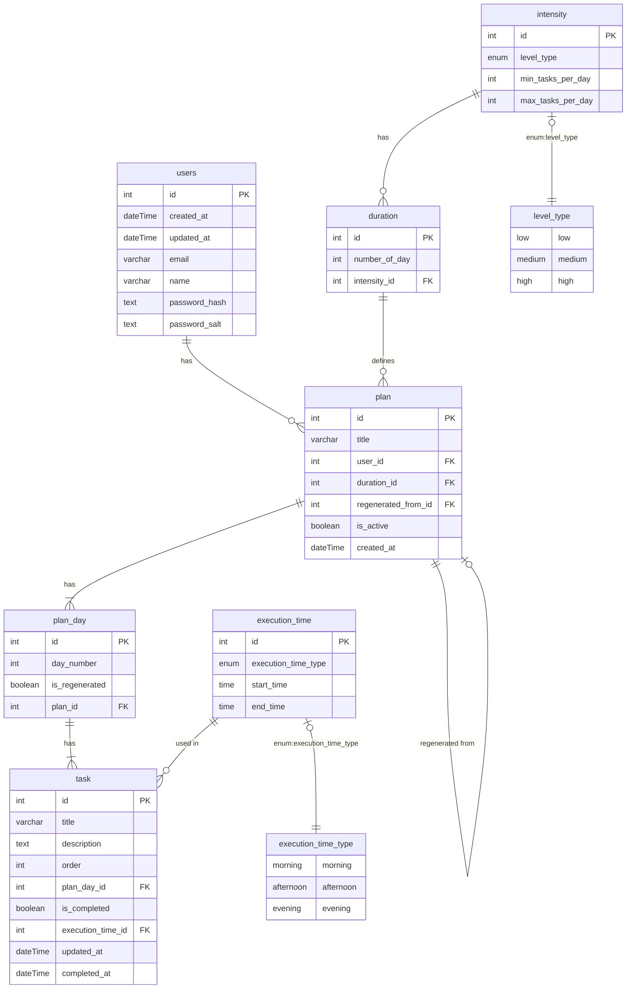

# Plan overview page

## 1. Quiz and Plan Generation
- Based on quiz results, a personalized plan is generated.
- The plan has:
  - A defined duration: **5, 14, or 21 days**.
  - Each duration should have its **intensity** and **frequency** of the task.
- Each user can have **multiple plans**.
- Plans are **personalised and cannot be shared**.

---

## 2. Plan Management
A user can:
- View all generated plans.
- Regenerate a plan (partially or completely).
- Regenerate a specific day or task.
- Edit individual task text.

Additional details:
- A plan stores its origin:
  - Reference to the plan it was regenerated from.
- Plans have an **active status** (e.g., only one active plan at a time).
- Plan **creation timestamp** is recorded.
- Plans have a list of **days (`plan_day`)**, and each day has:
  - An order number.
  - A list of tasks.

---

## 3. Task Structure & Tracking
- Each day (`plan_day`) has **1–5 tasks**, but the data model should allow any number of tasks per day.
- Tasks contain:
  - Plain text **title** and **description**.
  - Optional **tip**.
  - **Execution time** (morning, afternoon, evening).
  - **Order** within the day.
  - **Timestamps** for updates and completion.
- Tasks can be marked as **complete/incomplete**.
- Tasks do not have deadlines or unlock timers.

---

## 4. Progress & History
The system tracks:
- **History of checklists** should be saved.
- **History of plans**, so a user can return to and update previous plans.

