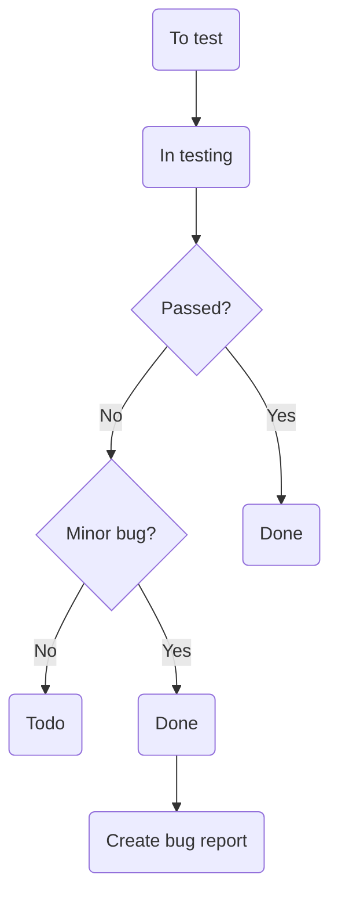

**Table of Contents**

[**1\. Introduction 1**](#_1fob9te)

[○ Analogues 2](#_3znysh7)

[○ Used technologies 2](#_2et92p0)

[○ Documents 2](#_tyjcwt)

[○ Project team 2](#_3dy6vkm)

[○ Project deadlines 2](#_1t3h5sf)

[○ Communications approach 2](#_4d34og8)

[**2\. Test Approach 3**](#_2s8eyo1)

[○ Types of Testing 4](#_3rdcrjn)

[○ Priorities for test activities 4](#_fbqlr8roa8w1)

[○ Weekly objectives for QA team 4](#_t3yx1ylgz2ma)

[○ Using templates 4](#_28xjbgu9ggk)

[3\. Acceptance criteria 4](#_i7z4e67m8zn)

[**3\. Test Environment 4**](#_lnxbz9)

[**4\. Testing Tools and Artifacts 5**](#_35nkun2)

[● Testing artifacts for the Project: 5](#_1ksv4uv)

[● Defect Life Cycle: 5](#_44sinio)

[● Automated testing: 6](#_2jxsxqh)

[**5\. Release Control 7**](#_z337ya)

[○ Testing entry criteria: 7](#_1y810tw)

[○ Testing exit criteria: 8](#_4i7ojhp)

[**6\. Additional Procedures 8**](#_qsh70q)

[1\. Meetings: 8](#_3as4poj)

[2\. Work review: 8](#_1pxezwc)

[3\. Testing team: 9](#_49x2ik5)

[**7\. Common risks 9**](#_2eo1akz3d35q)

[**8\. Test Plan (link to document) 9**](#_z4r34j607qmy)

#

# Introduction

The purpose of the test strategy for the **Checky Project** is to:

- Provide a central artifact to govern the strategic approach of the test effort; it defines the general approach to be employed when testing the software and when evaluating the results of that testing. Planning artifacts will refer to the test strategy regarding the governing of detailed testing work.
- Provide visible confirmation to test-effort stakeholders that adequate consideration has been given to governing the test effort and, where appropriate, to have those stakeholders approve the strategy.
- This QA Strategy outlines the test process, environments, tools, and collaboration methods used to ensure quality delivery of the **Checkly** project.

## Analogues

- Other tools in the productivity/self-improvement space, such as Notion kids, Duolingo, Fabulous, and AI-based planners and apps with a “Digital Friend” vibe (e.g., Reclaim AI, Mindsera, Pi by Inflection, Wysa), are considered loose analogues for features and UX inspiration.

## Used technologies

- Global:
  - [Node.js](https://nodejs.org/en), [npm](https://www.npmjs.com/), [TypeScript](https://www.typescriptlang.org/), [npm workspaces](https://docs.npmjs.com/cli/v9/using-npm/workspaces).

\_**\_**\_**\_**\_**\_**\_**\_**\_**\_**\_**\_**\_**\_**\_**\_**\_**\_**\_\_\_\_

- Backend
  - [Fastify](https://fastify.dev/), [Knex](https://knexjs.org/), [Objection](https://vincit.github.io/objection.js/)

\_**\_**\_**\_**\_**\_**\_**\_**\_**\_**\_**\_**\_**\_**\_**\_**\_**\_**\_\_\_\_

- Database
  - [PostgreSQL](https://www.postgresql.org/)

\_**\_**\_**\_**\_**\_**\_**\_**\_**\_**\_**\_**\_**\_**\_**\_**\_**\_**\_\_\_\_

- Frontend
  - [React](https://react.dev/), [Redux](https://redux.js.org/) \+ [Redux Toolkit](https://redux-toolkit.js.org/)

\_**\_**\_**\_**\_**\_**\_**\_**\_**\_**\_**\_**\_**\_**\_**\_**\_**\_**\_\_\_\_

- Schema validator
  - [Zod](https://github.com/colinhacks/zod)

The project is deployed to AWS.

Github actions are used for CI and CD.

Scrum model of SDLC.

## Documents

- App specifications: [Checkly Specification](https://docs.google.com/document/d/1n7MgJ1W41VG9-Whv3tWfll8dPvyI6tLCLWaRDBcNOL4/edit?tab=t.0)
- QA Strategy: [QA Strategy Document](https://docs.google.com/document/d/17IcmCg69D2_ocSquTNpoJ6jPF0mCwhJsoRvyQ1HoNIE/edit?tab=t.0) (This doc)
- Design: [Figma](https://www.figma.com/design/oHvA6oH7M9zDIs29gj2Sy2/Checkly?node-id=0-1&p=f)
- Test Plans: [Test Plan for Checkly v1](https://docs.google.com/document/d/1MYORyHZhrjjsREmHH2ZdBtcJ5Z4y1xErK_5LWinhtXk/edit?tab=t.0)

## Project team

The team that will work on the project:

- Developer team (10 members);
- QA team (3 members);
- 3 Coaches of the Developer team;
- 1 Mentor of the QA team;
- Product Owner

## Project deadlines

21/07/2025 - project starts.

30/08/2025 - release.

All works must be completed before 27/08/2025.

## Communications approach

Testers can communicate:

- With questions that arise during the development to mentor and coaches;
- With questions about the product to the product-owner during the demo;
- With any technical questions to the development team.

# Test Approach

A **proactive** approach will be used in the testing - an approach in which the test design process is initiated as early as possible in order to find and fix the defects before the build is created. Test design and planning will begin as soon as early versions of the flow are implemented.

- Manual testing
- Automated testing

Automated testing will cover all high-level features (only API tests should be automated).

## Types of Testing

The following types of testing will be used:

- Functional testing
- User interface testing
- Smoke testing
- Regression testing
- Acceptance testing
- API Testing (manual + automated)
- Exploratory testing \[Optional\]

## Priorities for test activities

- Verify critical flows: auth, onboarding, checklist generation.
- Gradually document features as they are built.
- Create basic UI and API test cases early.
- Increase automation coverage with each sprint.

## Weekly objectives for QA team

- Week 1-2:
  - Explore documentation, draft test plans and requirements.
  - Test login/signup flow.
- Week 3:
  - Define test cases, prepare bug reports.
  - Analyze quiz logic.
- Week 4+:
  - Execute test plans.
  - Being Automation.

## Using templates

### **Bug Report Pattern:**

1. Description
2. Device
3. Environment
   - Device
   - OS
   - Browser/Tool + Version
   - Branch
   - Date

4. Actual Result
5. Expected Result
6. Comment/Screenshot \[Optional\]

### Purpose

This Template is used by the QA team to:

- Document bugs in a clear, consistent format.
- Track testing context and environment for each issue.
- Share reproducible steps with the development team.
- Suggest expected results to help with fixes.

---

### Template

To create a new bug report, please copy the following template and fill it out with your findings:

```
# [Clear and descriptive bug title]

## Description
_→ What is the bug, and why is it a problem?_

## Steps to Reproduce
1. [Step 1]
2. [Step 2]
3. [Step 3]
4. [Observe the issue]

## Environment
- **Device:** [Desktop / Mobile / etc.]
- **OS:** [Windows, macOS, etc.]
- **Browser/Tool:** [e.g., Chrome v..., Postman, etc.]
- **Branch:** [`main`, `staging`, etc.]
- **Date:** [YYYY-MM-DD]

## Actual Result
_→ What actually happened?_

## Expected Result
_→ What should have happened instead?_

## Test Evidence
- ✅ [What worked correctly]
- ❌ [What didn’t work]
- 📸 [Screenshot or log, if applicable]

```

---

## ✅ Example

You can find examples of completed reports in the Tickets marked as **Bug** in te [project's board](https://github.com/orgs/BinaryStudioAcademy/projects/33/views/1?filterQuery=type%3ABug).

---

## Tips for Writing Good Reports

- Be specific: Include exact inputs, error messages, or screenshots.
- Be concise: Avoid unnecessary context or repetition.
- Be constructive: Suggest the correct behavior in the Expected Result section.
- Be respectful: The goal is to help improve the product, not to assign blame.

---

**User Story template:**

1. **Feature**
2. **Story**

   As a [ROLE], I want to [ACTION] so that [VALUE/GOAL].

3. **Acceptance criteria**

_\*Acceptance criteria will be defined per feature. In cases where they’re missing, QA will document assumptions and confirm with dev/PO. Criteria include: Expected behaviour, Success & Error handling, Validation rules, Response format._

# Test Environment

**Setup required for the test environment:**

- Local for early stage. Check the project’s development template on GitHub: [_Readme.md_](https://github.com/BinaryStudioAcademy/bsa-2025-checkly/blob/main/readme.md)
- Staging (TBD)

\[Browser; Display resolution; Display orientation; Localization of the project\]

_\*Update this info accordingly._

- Number of environments are defined by coaches on each project

_\*Update this info accordingly._

# Testing Tools and Artifacts

## Testing artifacts for the Project

All artifacts should be published on the Project’s GitHub board

- Test strategy (this document)
- Test plan ([link](https://docs.google.com/document/d/1MYORyHZhrjjsREmHH2ZdBtcJ5Z4y1xErK_5LWinhtXk/edit?tab=t.0))
- Bug Reports
- Test Case list or Check-list
- Mind Maps / Flows (optional)
- Traceability matrix (optional)
- API Test Suite (Postman)

## Defect Life Cycle



## Testing tools for the Project

- Postman (API Testing)
- Playwright (Automation)
- Qase (Test Case and Bug management)
- GitHub Actions (CI/CD, Automated test execution)

## Severity for the Project

Critical – Critical Impact/System Down. Complete system outage.

Major – Significant Impact/Severe downgrade of services.

Minor – Minor impact/Most of the system is functioning properly.

Trivial – Low Impact/Informational/Suggestion.

# Release Control

The project workspace is organized on the GitHub project board:

GitHub is used as a code hosting platform for version control and collaboration for this project.

## Testing entry criteria

- Basic documentation or design reference is available
- Requirements are finalized and approved
- Test plan and test cases are reviewed
- Fulfillment of acceptance criteria of the tickets.

## Testing exit criteria

- 90%+ test cases executed
- No Critical or Major bugs open
- Regression passed
- Demo-ready by deadline

# Additional Procedures

**To improve the testing process the following procedures are needed:**

## Meetings

- Daily SCRUM team meeting.
- QA mentor meeting (weekly; optional).
- QA team meetings (optional);
- Demo with PO.

## Work review

- Weekly review of test artifacts with QA mentor.
- Sprint retrospective with QA team.

## Testing team

Responsibilities of QA team members:

- Writing test documentation;
- Reviewing feature logic;
- Specification analysis;
- Manual testing;
- API testing (manual and automated);
- Report bugs and errors to development teams.

_The master branch must be frozen at least one day before demo each sprint._

# Common risks

What should someone do about it? Define responsible person and action point when this happens:

| **Risk**                        | **Action point**                                                         | **Responsible**     |
| ------------------------------- | ------------------------------------------------------------------------ | ------------------- |
| Absence of team member          | Notify mentor and re-assing tasks                                        | QA Team             |
| Your absence                    | Notify team in advance (if possible); document current work; leave notes | You (QA/Dev)        |
| Missing or Unclear Requirements | Request clarification; document assumptions; notify Mentor               | QA + Mentor         |
| Faulty test results             | Recheck data, rerun tests, validate with devs                            | QA + Dev            |
| Test environment not available  | Report issue; Use local setup if possible; Escalate                      | QA + Mentor / Coach |
| Not enough time for testing     | Prioritize critical test cases, reduce scope, inform team                | QA Team             |

# Test Plan ([Link](https://docs.google.com/document/d/1MYORyHZhrjjsREmHH2ZdBtcJ5Z4y1xErK_5LWinhtXk/edit?tab=t.0))

Test plan document should be composed by QA team

It must contain:

1. Plan ID
2. Introduction
3. Plan Scope
4. Feature Priorities
5. Test Approach (Frontend/Backend)
6. What will be Automated? (Automation Scope)
7. Features Planned
8. Features Implemented
9. Timeline and Demo Milestones
10. Team availability hours
